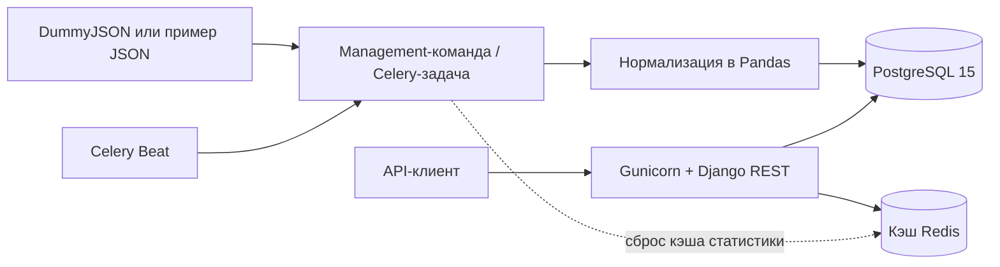

# Сервис товарной статистики

Небольшой REST API на Django для импорта товаров из
[DummyJSON](https://dummyjson.com/docs/products), нормализации данных с помощью
Pandas, хранения в PostgreSQL и расчёта средней цены по категориям.

В проекте нет фронтенда, административной панели и форм. Импорт можно запускать
вручную или по расписанию через Celery Beat.

## Архитектура



Docker Compose запускает сервисы `web`, `db`, `redis`, `celery-worker`,
`celery-beat` и одноразовый сервис `migrate`. Контейнеры приложения ожидают
готовности зависимостей и успешного выполнения миграций.

## Быстрый запуск

Для запуска нужен Docker Desktop с Docker Compose.

```bash
docker compose up --build
```

Для локальной демонстрации файл `.env` не обязателен: Docker Compose использует
настройки по умолчанию для разработки. Чтобы изменить конфигурацию, скопируйте
`.env.example` в `.env` до запуска. За пределами локальной среды обязательно
замените `DJANGO_SECRET_KEY` и данные доступа к PostgreSQL.

API будет доступен по адресу <http://localhost:8000>. Запуск в фоне с ожиданием
прохождения healthcheck:

```bash
docker compose up --build --detach --wait
```

Остановить сервисы, сохранив данные PostgreSQL:

```bash
docker compose down
```

Команда `docker compose down --volumes` дополнительно удалит том PostgreSQL и
все импортированные данные.

## Импорт товаров

Синхронно импортировать актуальные данные из DummyJSON:

```bash
docker compose exec web python manage.py import_items --source remote
```

Если внешний источник недоступен, можно загрузить 10 тестовых записей из
`data/sample_products.json`:

```bash
docker compose exec web python manage.py import_items --source sample
```

Поставить импорт из DummyJSON в очередь Celery:

```bash
docker compose exec celery-worker celery -A config call items.import_dummyjson_products
```

По умолчанию Celery Beat запускает задачу каждые 15 минут. Интервал задаётся
переменной `CELERY_IMPORT_INTERVAL_MINUTES`.

Импорт идемпотентен. Ограничение уникальности по паре `(source, external_id)`
не допускает дубликаты. Новые записи создаются, изменённые обновляются, а
неизменившиеся или устаревшие пропускаются. Запись выполняется транзакционно и
пакетными операциями. Redis-блокировка не позволяет двум плановым импортам
работать одновременно, а временные ошибки источника и Redis повторяются с
увеличивающейся задержкой.

## API

Эндпоинты намеренно объявлены без завершающего `/`.

### Получение товаров

```http
GET /items
```

Поддерживаемые query-параметры:

| Параметр | Описание |
| --- | --- |
| `category` | Точное совпадение категории |
| `price_min` | Минимальная цена включительно |
| `price_max` | Максимальная цена включительно |
| `page` | Номер страницы, начиная с 1 |
| `page_size` | Размер страницы: по умолчанию 20, максимум 100 |

Пример запроса с фильтрами и пагинацией:

```bash
curl "http://localhost:8000/items?category=beauty&price_min=10&price_max=50&page=1&page_size=5"
```

Ответ имеет стандартную структуру пагинации:

```json
{
  "count": 3,
  "next": null,
  "previous": null,
  "results": [
    {
      "id": 2,
      "source": "dummyjson",
      "external_id": "2",
      "name": "Eyeshadow Palette with Mirror",
      "category": "beauty",
      "price": "19.99",
      "updated_at": "2025-04-30T09:41:02.053000Z"
    }
  ]
}
```

Некорректные цены, диапазоны, номера и размеры страниц возвращают статус `400`.
Запрос страницы за пределами результата возвращает `404`.

### Средняя цена по категориям

```http
GET /stats/avg-price-by-category
```

```bash
curl -i "http://localhost:8000/stats/avg-price-by-category"
```

Агрегат рассчитывается через Pandas и кэшируется в Redis. Заголовок ответа
`X-Cache` имеет значение `MISS` при расчёте результата и `HIT` при чтении из
кэша. Если Redis временно недоступен, API продолжает работать и возвращает
`X-Cache: BYPASS`. Кэш сбрасывается только после создания или обновления
товаров во время импорта.

База Redis `/0` используется как брокер Celery, а `/1` — для кэша API. Время
жизни агрегата задаётся через `AVG_PRICE_CACHE_TTL_SECONDS` и по умолчанию
составляет 300 секунд.

## Тесты и качество кода

Для локальной разработки создайте виртуальное окружение Python 3.12 и
установите зависимости разработчика:

```bash
python -m venv .venv
python -m pip install -r requirements-dev.txt
pytest
ruff format --check .
ruff check .
```

Тесты проверяют нормализацию и расчёт среднего, разбор источников,
транзакционный и идемпотентный импорт, фильтрацию, пагинацию, валидацию,
кэширование и его сброс, Redis-блокировку Celery и расписание Beat. Для тестов
создаётся отдельная временная база PostgreSQL.

## Логи

Приложение и импорт пишут логи в stdout. Их собирает Docker:

```bash
docker compose logs -f web
docker compose logs -f celery-worker celery-beat
```
