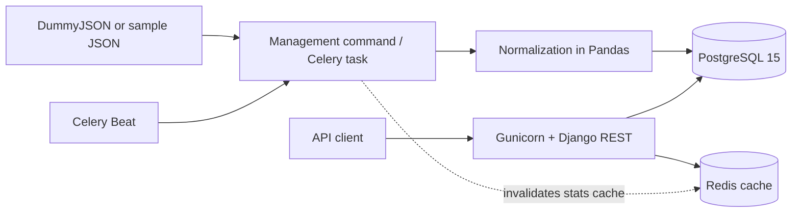

# Product statistics service

[](https://github.com/nurzhvn52/product-stats-api/actions/workflows/ci.yml)

A small Django REST API that imports products from
[DummyJSON](https://dummyjson.com/docs/products), normalizes them with Pandas, stores
them in PostgreSQL and computes the average price per category.

There is no frontend, admin panel or forms. The import runs on demand or on a schedule
through Celery Beat.

## Architecture



Docker Compose starts `web`, `db`, `redis`, `celery-worker`, `celery-beat` and a
one-off `migrate` service. Application containers wait until their dependencies are
healthy and the migrations have finished.

## Quick start

You need Docker Desktop with Docker Compose.

```bash
docker compose up --build
```

A `.env` file is optional for a local demo: Compose falls back to development
defaults. To change the configuration, copy `.env.example` to `.env` before starting.
Outside a local setup, always replace `DJANGO_SECRET_KEY` and the PostgreSQL
credentials.

The API is served at <http://localhost:8000>. To start in the background and wait for
the health checks:

```bash
docker compose up --build --detach --wait
```

Stop the services and keep the PostgreSQL data:

```bash
docker compose down
```

`docker compose down --volumes` also removes the PostgreSQL volume with all imported
data.

## Importing products

Import the current DummyJSON data synchronously:

```bash
docker compose exec web python manage.py import_items --source remote
```

If the external source is unavailable, load 10 sample records from
`data/sample_products.json`:

```bash
docker compose exec web python manage.py import_items --source sample
```

Queue a DummyJSON import in Celery:

```bash
docker compose exec celery-worker celery -A config call items.import_dummyjson_products
```

By default Celery Beat runs the task every 15 minutes; the interval is set by
`CELERY_IMPORT_INTERVAL_MINUTES`.

The import is idempotent. A unique constraint on `(source, external_id)` prevents
duplicates. New records are created, changed ones are updated, unchanged or outdated
ones are skipped. Writes happen in a transaction and in batches. A Redis lock keeps two
scheduled imports from running at the same time, and transient source or Redis errors
are retried with increasing delays.

## API

Endpoints are declared without a trailing `/` on purpose.

### List products

```http
GET /items
```

Supported query parameters:

| Parameter | Description |
| --- | --- |
| `category` | Exact category match |
| `price_min` | Minimum price, inclusive |
| `price_max` | Maximum price, inclusive |
| `page` | Page number, starting at 1 |
| `page_size` | Page size: 20 by default, 100 at most |

Example with filters and pagination:

```bash
curl "http://localhost:8000/items?category=beauty&price_min=10&price_max=50&page=1&page_size=5"
```

The response uses the standard pagination shape:

```json
{
  "count": 3,
  "next": null,
  "previous": null,
  "results": [
    {
      "id": 2,
      "source": "dummyjson",
      "external_id": "2",
      "name": "Eyeshadow Palette with Mirror",
      "category": "beauty",
      "price": "19.99",
      "updated_at": "2025-04-30T09:41:02.053000Z"
    }
  ]
}
```

Invalid prices, ranges, page numbers or page sizes return `400`. A page beyond the
result returns `404`.

### Average price per category

```http
GET /stats/avg-price-by-category
```

```bash
curl -i "http://localhost:8000/stats/avg-price-by-category"
```

The aggregate is computed with Pandas and cached in Redis. The `X-Cache` response
header is `MISS` when the result was computed and `HIT` when it came from the cache.
If Redis is temporarily down, the API keeps working and returns `X-Cache: BYPASS`. The
cache is invalidated only when an import creates or updates products.

Redis database `/0` is the Celery broker and `/1` is the API cache. The aggregate's
lifetime is set by `AVG_PRICE_CACHE_TTL_SECONDS`, 300 seconds by default.

## Tests and code quality

For local development, create a Python 3.12 virtual environment and install the
development dependencies:

```bash
python -m venv .venv
python -m pip install -r requirements-dev.txt
pytest
ruff format --check .
ruff check .
```

The tests cover normalization and the average calculation, source parsing, the
transactional and idempotent import, filtering, pagination, validation, caching and
cache invalidation, the Celery Redis lock and the Beat schedule. They run against a
separate temporary PostgreSQL database. CI runs the same checks on every push.

## Logs

The application and the import log to stdout, which Docker collects:

```bash
docker compose logs -f web
docker compose logs -f celery-worker celery-beat
```
